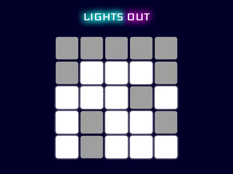

# Lights Out

A chance to work with React events where the state and events happen in different classes.

## The Game

Lights Out is a logic/puzzle game, played on a gird of individual lights, which can either be lit or unlit. The puzzle is won when when all of the lights are turned off. 

You can click on a cell to toggle that light — but it also toggles the light above it, to the left of it, to the right of it, and below it. (Cells on an edge or in the corner won’t flip as many lights, since they are missing some neighbors).

## My Finished Project

[Click here](https://tyecampbell-lightsout.netlify.com) to preview a live example. (It's fun!!)

### What I've Learned

* Creating and then rendering and array of arrays — all dynamically. 
* Lifting State from a child component to parent. Need to use an event handler in this process.
* Array.prototype.flat() with .find() works great for searcing through nested arrays
* Margin property does not apply to table cell elements — use border-spacing in the table parent. 

:thumbsup: *Thanks for checking out my work on GitHub! For more about me find me on Twitter [@TyeDev](https://twitter.com/tyedev) or visit my personal website [TyeCampbell.com](www.TyeCampbell.com).*
